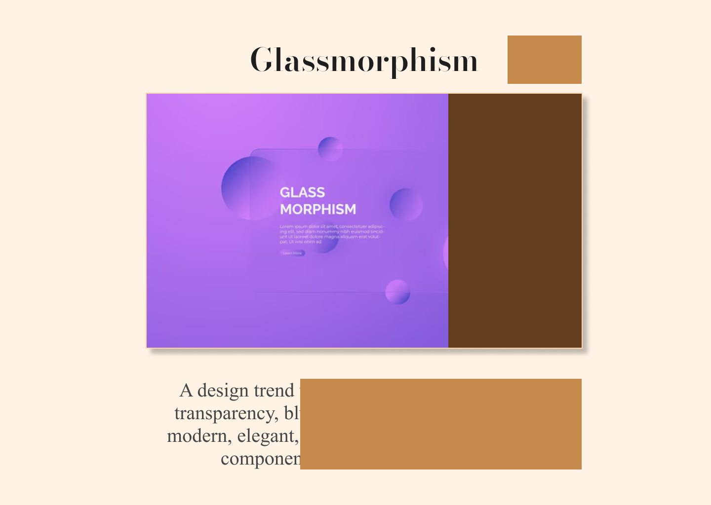

# Box Reveal Scroll Website  

🚀 **Interactive Box Reveal Scroll Animation web page**  

  
    

  

## 📖 Overview  
This project demonstrates a beautifully crafted scroll animation effect where content is revealed in boxes as the user scrolls down. The design focuses on **smooth animations**, **user engagement**, and **modern aesthetics**.  

## ✨ Features  
- **Box Reveal Scroll Animation**: Visually appealing and interactive content reveal while scrolling.  
- **Responsive Design**: Optimized for both mobile and desktop devices.  

### **🚀 Technologies Used**  
- **Figma**: To craft the initial design and layout.  
- **HTML & CSS**: To bring the design to life.  

---

## 🎥 Demo  
- **Live Website**: [View Here](https://dark1arrow.github.io/block-reveal-scroll/) 
- **Figma Design**: [View on Figma](https://www.figma.com/design/HYxLG8OmYzW7DmwO5DnTe0/Block-Reveal-Scroll?node-id=35-13&t=yz7wl2URceQPwVWU-1)
- **LinkedIn Profile**: [Visit My LinkedIn](https://www.linkedin.com/in/gouatm-khanna-61ba63262/?utm_source=share&utm_campaign=share_via&utm_content=profile&utm_medium=android_app)

📱 **Tip**: Rotate your phone to landscape for the best experience on mobile devices!